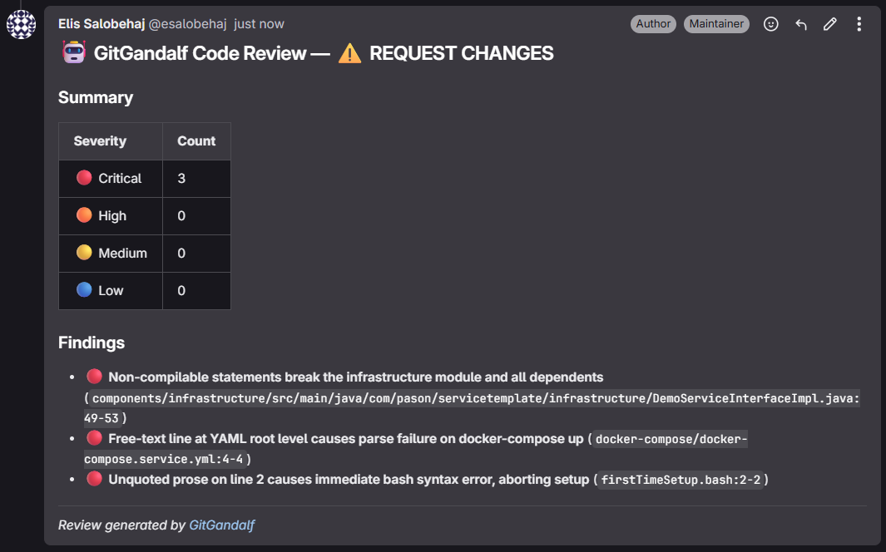
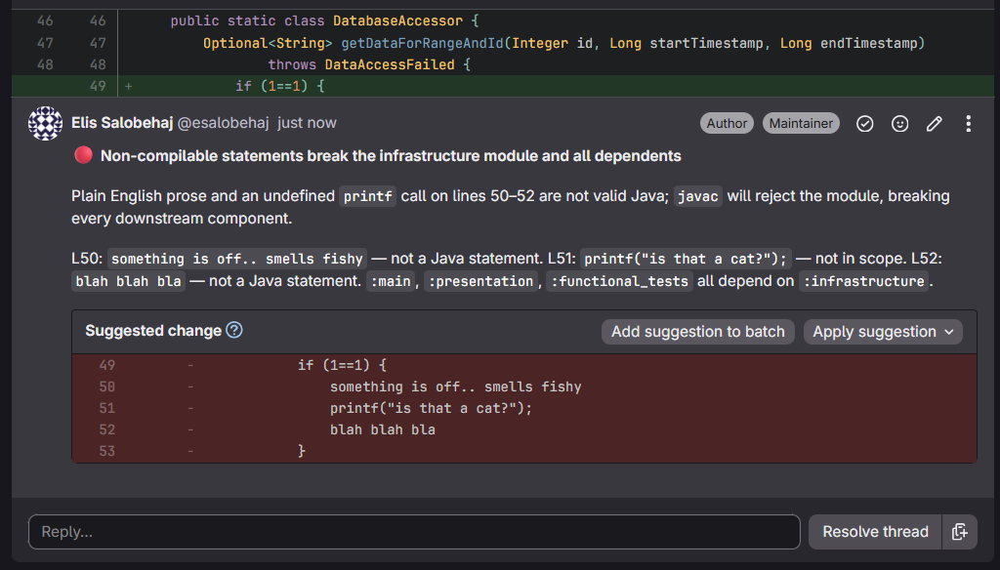
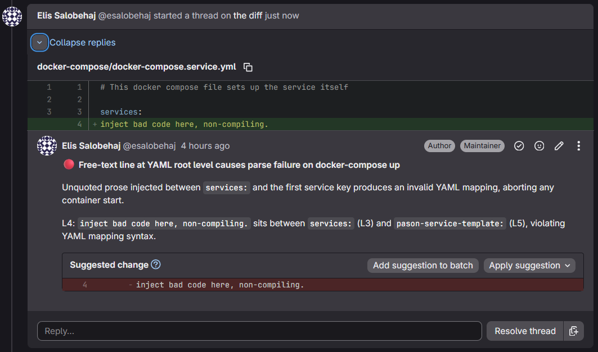
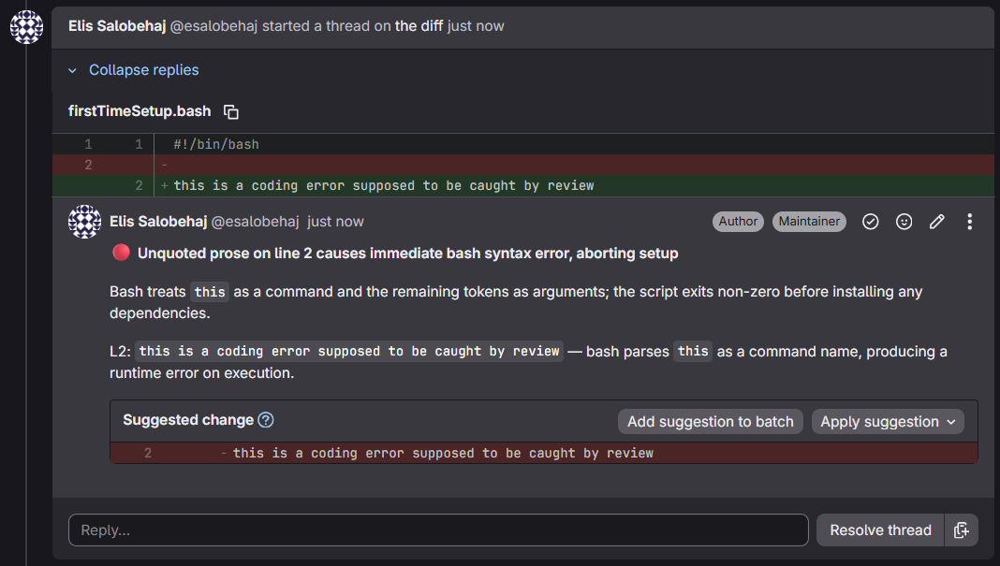

# GitGandalf

> AI-assisted, agentic code reviewer for GitLab merge requests.




GitGandalf is a self-hosted review service that listens to GitLab merge request events,
runs an agentic code-review pipeline against the diff and repository context, and posts
high-signal inline comments back to the MR.

It is built for teams that want code review automation without giving up control of their
runtime, provider stack, or deployment model.

---

## Table of Contents

- [Quick Start](#quick-start)
- [Features](#features)
- [Showcase](#showcase)
- [Review Flow](#review-flow)
- [Deployment Modes](#deployment-modes)
- [Tech Stack](#tech-stack)
- [Configuration](#configuration)
- [Local Kubernetes](#local-kubernetes)
- [Webhook Setup](#webhook-setup)
- [Runtime Notes](#runtime-notes)
- [Documentation Hub](#documentation-hub)
- [Development Commands](#development-commands)

---

## Quick Start

```bash
# Configure the app
cp .env.example .env

# Install dependencies
bun install

# Run the webhook server
bun run dev

# Optional: run the worker when QUEUE_ENABLED=true
bun run worker
```

Health check:

```bash
curl http://127.0.0.1:8020/api/v1/health
```

For local Kubernetes validation:

```bash
bun run kind:up
bun run kind:port-forward
bun run kind:down
```

---

## Features

- 🤖 **Agentic review pipeline** — context agent, investigator loop, and reflection agent work together before anything is published.
- 🛠️ **Repo-aware tools** — the investigator can read files, search the codebase, and inspect directory structure inside a sandboxed repo clone.
- 🧠 **Multi-provider LLM fallback** — AWS Bedrock first, with optional OpenAI and Google Gemini fallback ordering.
- 📨 **GitLab-native feedback** — publishes inline MR discussions when findings can be anchored and always posts a summary note.
- 🧵 **Queued review execution** — BullMQ + Valkey decouple webhook ingestion from long-running review jobs.
- ⏱️ **Timeout and dead-letter handling** — bounded worker attempts with retry policy and terminal-failure routing to `review-dead-letter`.
- ☸️ **Kubernetes-ready** — raw manifests for webhook, worker, service, config, secrets, and local Valkey validation on KinD.
- 🔎 **Jira enrichment** — optionally pulls linked Jira ticket context from MR title and description.
- 📜 **Structured logging** — LogTape JSON logs with request correlation, pipeline context, and debug-file output.

---

## Showcase

### Review Surface

| Inline Finding 1 | Inline Finding 2 |
|---|---|
|  |  |
| High-signal code review comment with concrete impact and a suggested diff. | Diff-anchored YAML issue surfaced directly in the merge request discussion. |

| Inline Finding 3 | Review Summary |
|---|---|
|  |  |
| Shell-script defect caught with exact line targeting and actionable reasoning. | Final verdict summary with severity counts and linked findings back into the MR. |

---

## Review Flow

```text
GitLab webhook -> router -> queue or inline dispatch -> pipeline -> Jira enrichment -> agents -> GitLab comments
```

1. GitLab sends a `merge_request` event or a `/ai-review` note event.
2. The router verifies `X-Gitlab-Token` and validates the webhook payload with Zod.
3. The request is either queued through BullMQ or run inline, depending on `QUEUE_ENABLED`.
4. The pipeline fetches MR metadata and diffs, then clones or updates the repo cache.
5. Optional Jira enrichment adds linked ticket context.
6. The agent pipeline investigates the change and filters weak or unsupported findings.
7. Verified findings are published back to GitLab as inline discussions and a summary note.

---

## Deployment Modes

| Mode | Use Case | Command / Entry |
|---|---|---|
| **Inline** | simplest local/dev flow | `bun run dev` |
| **Queued** | durable async review execution | `bun run dev` + `bun run worker` |
| **Docker Compose** | containerized local or server deployment | `docker compose up` |
| **KinD / Kubernetes** | local cluster validation and k8s parity | `bun run kind:up` |

When `QUEUE_ENABLED=true`, the webhook returns `202` only after BullMQ accepts the job.
If enqueue fails, the webhook returns `503` instead of silently dropping work.

---

## Tech Stack

| Layer | Technology |
|---|---|
| **Runtime** | Bun |
| **API** | Hono |
| **Language** | TypeScript (strict mode) |
| **Validation** | Zod |
| **Queue** | BullMQ + Valkey |
| **LLMs** | AWS Bedrock, OpenAI, Google Gemini |
| **GitLab Client** | `@gitbeaker/rest` |
| **Logging** | LogTape |
| **Infra** | Docker Compose, KinD, Kubernetes |

---

## Configuration

All configuration lives in the root `.env` file.

```bash
cp .env.example .env
```

### Core

| Variable | Description |
|---|---|
| `GITLAB_URL` | Base URL of the GitLab instance |
| `GITLAB_TOKEN` | Token used for API calls and authenticated clone/fetch operations |
| `GITLAB_WEBHOOK_SECRET` | Shared secret checked against `X-Gitlab-Token` |
| `PORT` | HTTP port, default `8020` |
| `LOG_LEVEL` | `debug`, `info`, `warn`, or `error` |

### Queueing

| Variable | Description |
|---|---|
| `QUEUE_ENABLED` | Enable BullMQ dispatch instead of inline fire-and-forget execution |
| `VALKEY_URL` | Valkey or Redis connection URL |
| `WORKER_CONCURRENCY` | Concurrent review jobs per worker |
| `REVIEW_JOB_TIMEOUT_MS` | Hard timeout per worker attempt |

### LLM Providers

| Variable | Description |
|---|---|
| `LLM_PROVIDER_ORDER` | Ordered provider list, e.g. `bedrock,openai` |
| `LLM_MODEL` | Bedrock model ID |
| `OPENAI_API_KEY` / `OPENAI_MODEL` | OpenAI fallback configuration |
| `GOOGLE_AI_API_KEY` / `GOOGLE_AI_MODEL` | Gemini fallback configuration |

### Jira Enrichment

| Variable | Description |
|---|---|
| `JIRA_ENABLED` | Enables Jira ticket enrichment |
| `JIRA_BASE_URL` | Jira Cloud base URL |
| `JIRA_EMAIL` / `JIRA_API_TOKEN` | Jira API credentials |
| `JIRA_PROJECT_KEYS` | Optional project-key allow-list |
| `JIRA_ACCEPTANCE_CRITERIA_FIELD_ID` | Optional acceptance-criteria custom field |

Full configuration reference: [docs/guides/GETTING_STARTED.md](docs/guides/GETTING_STARTED.md) and [docs/agents/context/CONFIGURATION.md](docs/agents/context/CONFIGURATION.md)

---

## Local Kubernetes

GitGandalf includes helper scripts for local KinD validation.

What the bootstrap does:

- creates the KinD cluster if it does not exist
- builds the local Docker image and loads it into the cluster
- generates ConfigMap and Secret resources from your local `.env`
- deploys Valkey, webhook, worker, and service manifests
- waits for rollouts to complete

Commands:

```bash
bun run kind:up
bun run kind:port-forward
bun run kind:down
```

The port-forward exposes the webhook service locally at `http://127.0.0.1:8020`.

---

## Webhook Setup

1. In GitLab, go to `Settings -> Webhooks`.
2. Set the webhook URL to `http://<reachable-host>:8020/api/v1/webhooks/gitlab`.
3. Set the secret token to `GITLAB_WEBHOOK_SECRET`.
4. Enable merge request events.
5. Enable note/comment events if you want `/ai-review` manual triggers.

If GitLab cannot reach your workstation directly, use an SSH reverse tunnel:

```bash
ssh -N -R 127.0.0.1:8020:localhost:8020 gitlab-user@gitlab.example.com
```

Use `ssh -R`, not `ssh -L`, when the goal is to expose your local GitGandalf process to the remote side.

---

## Runtime Notes

- Webhook schemas are permissive about extra GitLab keys but strict about required fields.
- Provider-specific translation stays isolated behind the internal protocol boundary in `src/agents/llm-client.ts` and `src/agents/providers/`.
- Review jobs use exponential backoff, enforce `REVIEW_JOB_TIMEOUT_MS`, and copy terminal failures into the `review-dead-letter` queue.
- Individual Agent 2 tool failures are returned to the model as error `tool_result` blocks instead of aborting the full review.
- Findings that cannot be anchored to the diff are skipped for inline publication and preserved in the summary verdict flow.
- When `LOG_LEVEL=debug`, logs are also written to `logs/gg-dev.log`.
- Jira errors degrade safely: they are logged as warnings and never abort a review.

---

## Documentation Hub

| Guide | Description |
|---|---|
| [docs/README.md](docs/README.md) | Main documentation index and phase status |
| [docs/guides/GETTING_STARTED.md](docs/guides/GETTING_STARTED.md) | Setup, env config, queueing, provider fallback, and KinD bootstrap |
| [docs/guides/DEVELOPMENT.md](docs/guides/DEVELOPMENT.md) | Bun commands, testing strategy, and development workflow |
| [docs/agents/context/ARCHITECTURE.md](docs/agents/context/ARCHITECTURE.md) | Concise implementation architecture |
| [docs/humans/context/ARCHITECTURE.md](docs/humans/context/ARCHITECTURE.md) | Expanded architecture walkthrough |

---

## Development Commands

```bash
bun test
bun run typecheck
bun run check
bun run ci
```

## License

Apache 2.0 - see [LICENSE](LICENSE).
