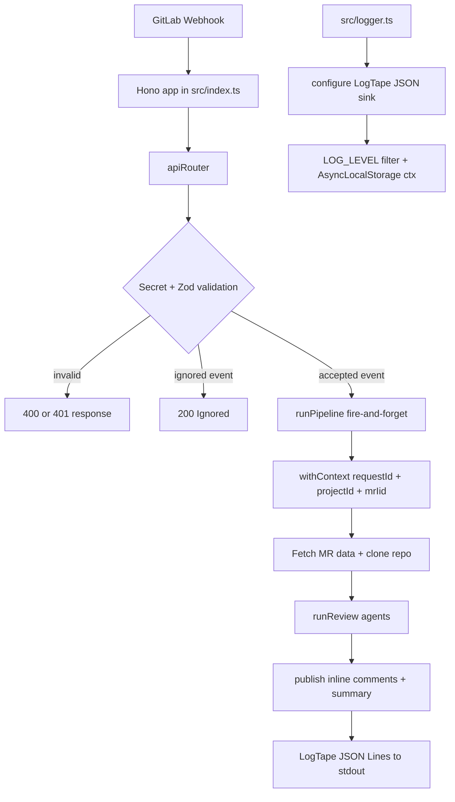

# Architecture

GitGandalf is a Bun-native webhook service built in phases. The current repository includes the full webhook-to-review-to-publish path: webhook ingestion, typed GitLab access, repo cache management, modular tool execution, the multi-agent review subsystem, GitLab publishing, deployment packaging, and structured logging with request correlation.

For the concise agent-optimized version, see [`docs/agents/context/ARCHITECTURE.md`](../../agents/context/ARCHITECTURE.md).

## Current Implemented Architecture



## Directory Structure

```text
git-gandalf/
├── .env.example                    # Template for secrets & config
├── .gitignore
├── docker-compose.yml
├── Dockerfile
├── package.json                    # Dependencies & scripts
├── tsconfig.json                   # TypeScript configuration
├── bunfig.toml                     # Bun-specific config (optional)
├── README.md
├── src/
│   ├── index.ts                    # Hono app entrypoint + server bootstrap, calls initLogging()
│   ├── logger.ts                   # LogTape configuration: initLogging(), getLogger/withContext re-exports
│   ├── config.ts                   # Env vars via Zod-validated process.env
│   ├── api/
│   │   ├── router.ts               # Webhook + health route definitions
│   │   ├── schemas.ts              # Zod schemas for GitLab webhook payloads
│   │   └── pipeline.ts             # Full pipeline: fetch MR data, clone repo, run agents, publish findings
│   ├── gitlab-client/
│   │   ├── client.ts               # @gitbeaker/rest wrapper (fetch MR, diff, discussions)
│   │   └── types.ts                # TypeScript types for GitLab data (MRDetails, DiffFile, etc.)
│   ├── context/
│   │   ├── repo-manager.ts         # Clone/cache repos via Bun.spawn + git CLI
│   │   └── tools/                  # Agent tools — one file per tool
│   │       ├── index.ts            # Aggregates TOOL_DEFINITIONS[], exports executeTool()
│   │       ├── shared.ts           # SearchResult type + assertInsideRepo() guard
│   │       ├── read-file.ts        # read_file tool definition + implementation
│   │       ├── search-codebase.ts  # search_codebase tool definition + implementation
│   │       └── get-directory-structure.ts  # get_directory_structure tool definition + implementation
│   ├── agents/
│   │   ├── orchestrator.ts         # Custom state-machine pipeline (runReview entrypoint)
│   │   ├── state.ts                # ReviewState type + Finding type definitions
│   │   ├── llm-client.ts           # Bedrock/Anthropic SDK wrapper + tool-call helpers
│   │   ├── context-agent.ts        # Agent 1: Context & Intent Mapper
│   │   ├── investigator-agent.ts   # Agent 2: Socratic Investigator (tool loop)
│   │   └── reflection-agent.ts     # Agent 3: Reflection & Consolidation
│   └── publisher/
│       └── gitlab-publisher.ts     # Format findings → GitLab inline comments + summary
└── tests/
	├── fixtures/
	│   ├── sample_mr_event.json    # Sample MR open event payload
	│   └── sample_note_event.json  # Sample /ai-review note event payload
	├── webhook.test.ts             # Phase 1 tests
	├── tools.test.ts               # Phase 2 tests
	├── agents.test.ts              # Phase 3 tests
	├── agents-entrypoints.test.ts  # Direct Phase 3 agent entrypoint tests with mocked LLM responses
	└── publisher.test.ts           # Phase 4 tests
```

## Phase Ownership

| Area | Current Status | Owning Phase | Notes |
|---|---|---|---|
| `src/index.ts`, `src/api/`, `src/config.ts` | Implemented | Phase 1 | Webhook ingress, health endpoint, strict payload validation, and config loading are live. |
| `src/logger.ts` | Implemented | Logging plan | Structured JSON logging via LogTape; `LOG_LEVEL` wired; request correlation via `withContext()`. |
| `src/gitlab-client/` | Implemented | Phase 1 | Typed GitLab wrapper exists, including read and write methods needed by later phases. |
| `src/context/repo-manager.ts` | Implemented | Phase 2 | Shallow clone/update cache manager with TTL cleanup and host validation. |
| `src/context/tools/` | Implemented | Phase 2 and 2.5 | Tool surface exists and was modularized in Phase 2.5 into one file per tool. |
| `src/agents/` | Implemented | Phase 3 | Shared state, Bedrock client wrapper, context agent, investigator agent, reflection agent, and orchestrator are implemented and invoked by the API pipeline. |
| `src/publisher/` | Implemented | Phase 4 | GitLab publisher posts inline comments and a summary comment, with duplicate detection and diff-position anchoring. |
| `Dockerfile`, `docker-compose.yml`, top-level `README.md` | Implemented | Phase 4 | Deployment packaging and end-user project documentation are present in the repository. |
| `tests/webhook.test.ts` | Implemented | Phase 1 | Covers auth, filtering, invalid payloads, and strict schema behavior. |
| `tests/tools.test.ts`, `tests/repo-manager.test.ts` | Implemented | Phase 2 and 2.5 | Covers tool sandboxing, search and tree behavior, repo cache cleanup, and SSRF guard behavior. |
| `tests/agents.test.ts`, `tests/agents-entrypoints.test.ts` | Implemented | Phase 3 | Covers prompt builders/parsers, orchestrator control flow, and direct agent entrypoints with mocked LLM responses. |
| `tests/publisher.test.ts` | Implemented | Phase 4 | Covers comment formatting, duplicate detection, diff anchoring, error continuation, and summary-note posting. |

## Implemented Components

### Hono server

- `src/index.ts` creates the app, calls `initLogging()`, enables structured HTTP request logging via `@logtape/hono` middleware (JSON Lines, health check excluded), mounts `/api/v1`, and exports Bun server config.
- `GET /api/v1/health` returns `{ status: "ok", timestamp }`.

### Structured logging

`src/logger.ts` is the single logging configuration module.

- **Library**: LogTape (`@logtape/logtape` + `@logtape/hono`) — zero dependencies, Bun-native Web APIs, first-party Hono middleware.
- **Output**: JSON Lines to stdout via `getConsoleSink({ formatter: jsonLinesFormatter })`. When `LOG_LEVEL=debug` outside tests, the same records are also appended to `logs/gg-dev.log` in the project root.
- **Level control**: `config.LOG_LEVEL` maps to LogTape's `lowestLevel` on the root `["gandalf"]` category. All child categories (`["gandalf", "router"]`, `["gandalf", "orchestrator"]`, etc.) inherit it automatically.
- **Request correlation**: `requestId` is generated in the router via `Bun.randomUUIDv7()`. Both the router and pipeline call `withContext()` to set `requestId`, `projectId`, and `mrIid` as implicit context via `AsyncLocalStorage`. Every log line emitted anywhere in the pipeline carries these fields without explicit passing.
- **Future sinks**: Adding `@logtape/otel` or `@logtape/sentry` only requires adding a new sink to `initLogging()` — no call-site changes.

### Webhook router

`src/api/router.ts` does four real jobs today:

1. verifies the GitLab shared secret
2. validates webhook payloads with strict Zod schemas
3. filters down to merge-request review triggers
4. hands the event to `runPipeline(event)` without blocking the HTTP response

The filter rules are intentionally narrow:

- merge request actions: `open`, `update`, `reopen`
- note trigger: `/ai-review` comment on a merge request

### Zod schema boundary

`src/api/schemas.ts` defines strict object schemas for:

- project identity
- user identity
- merge request attributes
- note attributes
- a discriminated union over `object_kind`

This means extra top-level keys are rejected rather than tolerated silently.

### GitLab client wrapper

`src/gitlab-client/client.ts` wraps `@gitbeaker/rest` behind a smaller domain API:

- `getMRDetails()`
- `getMRDiff()`
- `getMRDiscussions()`
- `createMRNote()`
- `createInlineDiscussion()`

The wrapper also handles gitbeaker’s awkward snake_case response shapes and camelCase create-option shapes in one place.

### Repo cache manager

`src/context/repo-manager.ts` is the repo access layer used by the current review pipeline.

- repo cache path: `<REPO_CACHE_DIR>/<projectId>`
- first-time path: `git clone --depth 1 --branch <branch>`
- refresh path: `git fetch origin <branch> --depth 1` + `git reset --hard origin/<branch>`
- cleanup: TTL-based eviction using directory `mtime`

Security detail: the clone URL hostname must match `GITLAB_URL`. The manager refuses to inject the GitLab token into a different host, which blocks token exfiltration through a malicious webhook payload.

### Modular tool system

Phase 2.5 split the original monolithic `src/context/tools.ts` into per-tool modules under `src/context/tools/`.

- `read-file.ts`
- `search-codebase.ts`
- `get-directory-structure.ts`
- `shared.ts`
- `index.ts`

This keeps each tool independently testable and makes the public API surface explicit in one place.

### Agent review subsystem

Phase 3 adds the review logic itself under `src/agents/`.

- `state.ts` defines `Finding` and `ReviewState`
- `llm-client.ts` wraps the Anthropic Bedrock messages API
- `context-agent.ts` derives MR intent, changed areas, and initial risk hypotheses
- `investigator-agent.ts` runs the tool loop against the cloned repository context
- `reflection-agent.ts` filters noise and assigns the review verdict
- `orchestrator.ts` coordinates the three stages and allows one reinvestigation loop

This review subsystem is implemented, tested, and wired into the full API pipeline.

## What Is Still Planned

The target architecture in the master plan goes further than the current implementation.

### Phase 5+

- task queue and worker split
- Kubernetes deployment shape
- provider fallback and LLM abstraction hardening

## Why the Design Looks This Way

- Bun is used directly for runtime, subprocesses, and file access to keep the stack small and fast.
- Zod is used at all external boundaries so invalid inputs fail before they enter core logic.
- The tool system is split by file so future tools are modular and reusable.
- The agent subsystem remains independently testable even though it is now wired into the full API pipeline.

## ELI5

GitGandalf can receive a webhook, validate it, fire the full multi-agent review pipeline, and post inline comments plus a summary note back to GitLab. Every step emits structured JSON logs to stdout, each carrying the same `requestId` so you can trace a single review end-to-end in any log aggregator.
