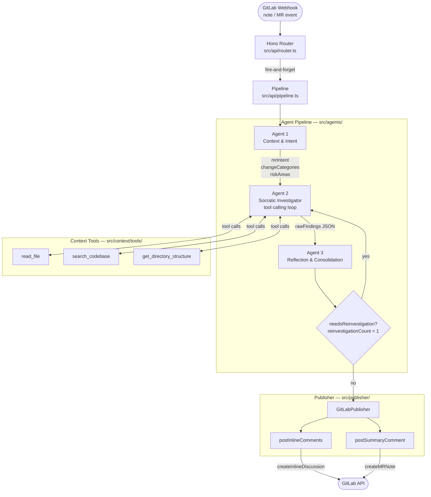

# GitGandalf Multi-Agent Architecture

## 🧭 Overview

GitGandalf uses a three-agent pipeline to review GitLab Merge Requests. A webhook event
fires, a lightweight state machine runs three specialized LLM agents in sequence, and the
results are published back to GitLab as inline discussion threads and a top-level MR note.

The pipeline is intentionally sequential rather than a parallel graph: each agent feeds the
next, and the output of every stage is Zod-validated at the boundary before it enters the
next.

---

## ✅ Current Implementation Snapshot

The active pipeline in `src/agents/orchestrator.ts` implements:

```
Webhook → Context Agent → Investigator Agent (tool loop) → Reflection Agent
                                    ↑                            ↓
                                    └── re-investigation ──── (if flagged, max 1)
                                                                 ↓
                                                          GitLab Publisher
```

---

## 🏗️ Architecture Diagram



---

## 🧩 Agent Details

### Agent 1 — Context & Intent (`context-agent.ts`)

| Attribute    | Value                                                  |
|--------------|--------------------------------------------------------|
| **Tools**    | None                                                   |
| **Input**    | MR title, description, diff (capped at 8 000 chars)   |
| **Output**   | `mrIntent`, `changeCategories`, `riskAreas` (JSON)    |
| **Validated**| Zod strict shape at parse boundary                    |

Produces at most 5 risk hypotheses for Agent 2 to investigate. Does not have tool access —
deliberately kept cheap and fast.

---

### Agent 2 — Socratic Investigator (`investigator-agent.ts`)

| Attribute    | Value                                                              |
|--------------|--------------------------------------------------------------------|
| **Tools**    | `read_file`, `search_codebase`, `get_directory_structure`         |
| **Input**    | `mrIntent`, `changeCategories`, `riskAreas`, diff                 |
| **Output**   | JSON array of `Finding[]`                                         |
| **Validated**| Zod `findingSchema` array at parse boundary                       |
| **Loop cap** | `MAX_TOOL_ITERATIONS` (from config) tool rounds before forced end |

This is the most expensive agent. It runs a Converse tool-calling loop: form a question,
call tools to gather evidence, record a finding, repeat. When it stops calling tools it
emits a raw JSON array.

**Finding schema** (all fields validated by Zod):

| Field              | Type                              | Description                                               |
|--------------------|-----------------------------------|-----------------------------------------------------------|
| `file`             | `string`                          | Repo-relative path                                        |
| `lineStart`        | `number`                          | First line of the finding                                 |
| `lineEnd`          | `number`                          | Last line of the finding (same as lineStart for single)   |
| `riskLevel`        | `critical\|high\|medium\|low`     | Severity                                                  |
| `title`            | `string`                          | ≤ 10 words                                                |
| `description`      | `string`                          | 1–2 sentences of what/why                                |
| `evidence`         | `string`                          | Verbatim code or tool output proving the issue            |
| `suggestedFix`     | `string?`                         | Prose explanation of the fix (rendered in markdown)       |
| `suggestedFixCode` | `string?`                         | Replacement lines for the GitLab `suggestion` block       |

---

### Agent 3 — Reflection & Consolidation (`reflection-agent.ts`)

| Attribute    | Value                                                                       |
|--------------|-----------------------------------------------------------------------------|
| **Tools**    | None                                                                        |
| **Input**    | `rawFindings[]`, `mrIntent`                                                 |
| **Output**   | `verifiedFindings[]`, `summaryVerdict`, `needsReinvestigation` (JSON)      |
| **Validated**| Zod schema at parse boundary                                                |

Filters noise (style opinions, speculation) and produces the final set the publisher uses.
Can signal `needsReinvestigation=true` to trigger one additional Agent 2 pass.

---

### GitLabPublisher (`publisher/gitlab-publisher.ts`)

Translates `verifiedFindings[]` into GitLab API calls:

- `postInlineComments()` — one GitLab inline discussion per finding, anchored to the
  nearest added diff line within the finding's `lineStart`–`lineEnd` range.
  Skips findings that have no added diff line in range (cannot be anchored).
  Deduplicates against existing GitGandalf comments by marker prefix in note body.
- `postSummaryComment()` — one top-level MR note with verdict badge, finding table,
  and severity counts.

---

## 🗺️ Data Flow

```
ReviewState
  ├── mrDetails            (fetched before pipeline starts)
  ├── diffFiles            (fetched before pipeline starts)
  ├── repoPath             (shallow clone, cached)
  │
  ├── mrIntent             ← Agent 1
  ├── changeCategories     ← Agent 1
  ├── riskAreas            ← Agent 1
  │
  ├── rawFindings[]        ← Agent 2
  ├── messages[]           ← Agent 2 (full tool-call history)
  │
  ├── verifiedFindings[]   ← Agent 3
  ├── summaryVerdict       ← Agent 3
  └── needsReinvestigation ← Agent 3
```

---

## ⚠️ Known Issues

### 1. Duplicate findings (active bug)

**What happens**: Agent 2 can produce the same finding twice in a single run. This occurs
when the same code block surfaces from two different tool calls (e.g., once from
`read_file` and once from `search_codebase`). Agent 3 currently has no explicit
deduplication instruction — it filters for noise but does not merge identical findings.

**Symptom observed (MR #16, notes 57006 and 57007)**:
Two notes with *identical* content posted to lines 49-51 of the same file. Same title,
same evidence, same suggestion. Both pass through Reflection and reach the publisher.

**Root cause**: Agent 3 prompt does not instruct it to detect and collapse findings with
the same `file + lineStart + lineEnd + title` combination.

---

### 2. Overlapping findings on the same code block (active bug)

**What happens**: Agent 2 produces separate findings for multiple symptoms within the same
contiguous code block. Each symptom gets its own `lineStart/lineEnd`, which may be a
sub-range of another finding's range in the same file. Agent 3 does not merge them.

**Symptom observed (MR #16, notes 57006 and 57008)**:
- Finding A: lines 49–51 — "Unconditional exception throw makes method always fail"
- Finding B: lines 50–50 — "NoDataException thrown from method not declared to throw it"

Both originate from the same three-line injected block. They result in two separate inline
comments on adjacent lines, making the review noisy and confusing for the developer.

**Root cause**: Agent 2 is prompted at the *symptom* level, not the *code block* level.
Each detectable issue gets its own finding rather than being consolidated into one finding
covering the full diff hunk that caused all symptoms.

---

### 3. No block-level hunk awareness in Agent 2

**What happens**: Agent 2 investigates individual risk hypotheses from Agent 1, which are
already line/construct oriented. It has no explicit awareness that a diff hunk (a
contiguous `@@` block in the diff) should be treated as a single unit of review.

**Effect**: For a 5-line injected block with 3 distinct issues, the investigator will
produce 3 findings (or more, via duplicates) rather than 1 consolidated finding with all
issues listed. This directly causes the noisy inline comments problem above.

---

## 🛠️ Proposed Improvements

### P1 — Deduplication in Reflection (short-term, high priority)

Add an explicit deduplication step to Agent 3's prompt:

> "Before emitting `verifiedFindings`, deduplicate: if two or more findings refer to
> the same file and have overlapping or identical line ranges AND describe the same root
> cause, merge them into a single finding. Use the widest line range, the highest risk
> level, and combine the descriptions."

This is a prompt-only change with no schema changes required.

---

### P2 — Block-level grouping in Agent 2 (short-term, high priority)

Update the investigator system prompt to reason at the *diff hunk* level:

> "When you find multiple issues in the same contiguous code block (same file, lines
> within the same `@@` hunk), produce ONE finding that covers the full block range.
> List all issues in the description. Do not emit separate findings for each symptom of
> the same root cause."

The `lineStart`/`lineEnd` should cover the full block, not just the individual line of
each symptom.

---

### P3 — Structural deduplication in ReviewState (medium-term)

Add a deterministic post-processing step in `orchestrator.ts` *after* Agent 3 that
normalises findings programmatically before publishing:

1. Sort findings by `file`, then `lineStart`.
2. Merge any two findings with overlapping ranges in the same file into one (max risk level,
   combined description, widest range).
3. Deduplicate identical `file + lineStart + lineEnd + title` tuples.

This makes deduplication deterministic and not dependent on LLM instruction-following.

---

### P4 — Diff hunk parsing as first-class context (longer-term)

Pre-process `diffFiles` before the pipeline runs to extract structured hunk objects:

```typescript
interface DiffHunk {
  file: string;
  hunkHeader: string;   // e.g. "@@ -40,3 +40,6 @@"
  addedLines: { lineNumber: number; content: string }[];
  removedLines: { lineNumber: number; content: string }[];
  contextLines: { lineNumber: number; content: string }[];
}
```

Pass these structured hunks to Agent 2 instead of raw diff text. Each hunk becomes a
natural unit of review. The investigator can then anchor findings to hunks, and a single
hunk with multiple issues maps to a single finding covering the hunk's line range.

---

## 📊 Finding-to-Comment Rendering Rules

| Condition                                         | GitLab output                          |
|---------------------------------------------------|----------------------------------------|
| Finding anchorable to an added diff line          | Inline discussion thread               |
| Finding not anchorable (no `+` lines in range)   | Silently skipped (logged as warning)   |
| `suggestedFixCode` is a non-empty string          | `suggestion` block with replacement    |
| `suggestedFixCode` is an empty string `""`        | Empty `suggestion` block (= deletion)  |
| `suggestedFixCode` is absent / `undefined`        | No suggestion block; prose only        |

The suggestion block **must never contain prose**. Only replacement source lines go inside
`` ```suggestion ```. Human-readable explanation belongs in `suggestedFix` (prose field),
which renders as a `**Suggested Fix**: …` markdown line above the block.

---

## 🔮 Future Agent Roles (Planned)

| Agent              | Role                                    | Status      |
|--------------------|-----------------------------------------|-------------|
| Context & Intent   | Risk classification from diff           | ✅ Live      |
| Investigator       | Tool-calling deep inspection            | ✅ Live      |
| Reflection         | Filter, consolidate, verdict            | ✅ Live      |
| Deduplicator       | Deterministic hunk-level merge          | 📋 Planned  |
| Acknowledger       | Immediate Gandalf reply on trigger      | 📋 Planned (Gandalf Awakening P3) |
| Tone Adapter       | Gandalf vs professional summary voice   | 📋 Planned (Gandalf Awakening P4) |
