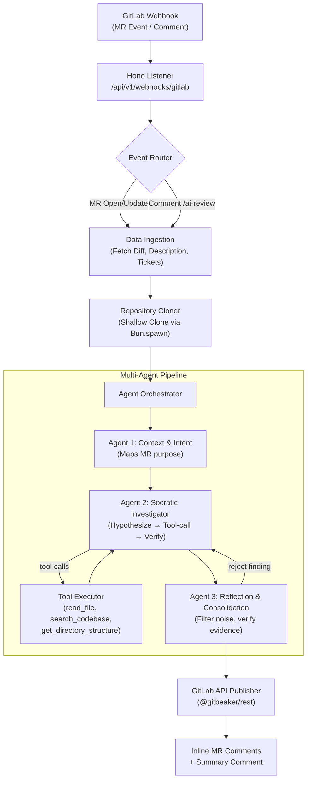
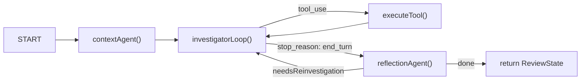

# GitGandalf — Master Implementation Plan

> **Ecosystem**: TypeScript · **Runtime**: Bun · **Framework**: Hono
>
> This is the definitive implementation plan for GitGandalf (GG) — a self-hosted, multi-agent code review service that intercepts GitLab MR events, deeply reasons about code changes using LLM-powered agents with tool-calling capabilities, and posts high-signal, inline review comments back to the MR.
>
> **Reference**: See [tech-stack-evaluation-design-choices.md](tech-stack-evaluation-design-choices.md) for the full Python vs TypeScript ecosystem analysis that led to this decision.

---

## Technology Stack

| Concern | Choice | Rationale |
|---|---|---|
| **Runtime** | **Bun** | Single binary: runtime + package manager + bundler + test runner. Fast startup (~100ms), `posix_spawn(3)` for subprocesses, native `Bun.file()` for zero-copy file reads. |
| **Web Framework** | **Hono** | Ultralight (~20KB), Web Standards-based, 111K+ req/s on Bun. First-class TypeScript. Zod integration via `@hono/zod-validator`. |
| **LLM Provider** | **AWS Bedrock** via `@anthropic-ai/bedrock-sdk` | Claude Sonnet 4 primary. Uses familiar Anthropic Messages API (tool_use support) routed through Bedrock IAM auth. Fallback: OpenAI/Google API keys in Phase 5+. |
| **Agent Orchestration** | **Custom state-machine orchestrator** (~250 LOC) | GG's 3-agent pipeline is a linear graph with 2 small loops — simple enough that LangGraph.js adds complexity without proportional value. Custom code is more debuggable, zero-dependency, and fully typed. |
| **LLM Abstraction** | **Direct SDK** (Phases 1-4) | Use `@anthropic-ai/bedrock-sdk` directly. Defer multi-provider abstraction (Vercel AI SDK) to Phase 6+. |
| **GitLab API Client** | **`@gitbeaker/rest`** | Actively maintained (v43.8+), fully typed, comprehensive GitLab API coverage. Works on Bun natively. |
| **Git Operations** | **`Bun.spawn()`** + native Git CLI | Pragmatic: `posix_spawn(3)` is the fastest subprocess model. Uses system `git` and `ripgrep` (trivial Docker install). Avoids `isomorphic-git` overhead and `simple-git` unnecessary abstraction. `Bun.file().text()` for zero-copy file reads. |
| **Validation** | **Zod** | Runtime type validation + static type inference. TypeScript-native Pydantic equivalent. |
| **Task Queue (Phase 5+)** | **BullMQ** (MIT) + **Valkey** | BullMQ explicitly supports Valkey. Use `iovalkey` (100% TS Redis/Valkey client). Open-source only. |
| **Deployment (Phase 1-4)** | **Docker Compose** | Simple, reproducible, self-contained. |
| **Deployment (Phase 5+)** | **Kubernetes** | Start with KinD for local dev. Keep EKS/GKE parity in mind from the start. |

> [!TIP]
> **Why Custom Orchestrator over LangGraph.js?** GG's pipeline is a linear graph with 2 controlled loops (Agent 2 ↔ Tools, Agent 3 → Agent 2 re-investigation). A custom orchestrator gives full control, zero framework overhead, and is easier to debug. LangGraph.js is a second-class citizen in the LangChain ecosystem (Python-first docs, features lag). The ~250 lines of custom code are simpler than the LangGraph dependency tree.

> [!TIP]
> **Why `Bun.spawn()` over `isomorphic-git`?** We run in Docker — installing `git` and `ripgrep` is one line (`apk add git ripgrep`). `isomorphic-git` is designed for browser/edge environments where native Git isn't available. It's 2-3x slower for cloning, struggles with large repos, and you'd still need `ripgrep` via subprocess for search. `Bun.spawn()` gives us native Git speed with the simplest possible code.

---

## High-Level Architecture



---

## Directory Structure

```
git-gandalf/
├── .env.example                    # Template for secrets & config
├── .gitignore
├── docker-compose.yml
├── Dockerfile
├── package.json                    # Dependencies & scripts
├── tsconfig.json                   # TypeScript configuration
├── bunfig.toml                     # Bun-specific config (optional)
├── README.md
├── src/
│   ├── index.ts                    # Hono app entrypoint + server bootstrap
│   ├── config.ts                   # Env vars via Zod-validated process.env
│   ├── api/
│   │   ├── router.ts               # Webhook + health route definitions
│   │   └── schemas.ts              # Zod schemas for GitLab webhook payloads
│   ├── gitlab-client/
│   │   ├── client.ts               # @gitbeaker/rest wrapper (fetch MR, diff, discussions)
│   │   └── types.ts                # TypeScript types for GitLab data (MRDetails, DiffFile, etc.)
│   ├── context/
│   │   ├── repo-manager.ts         # Clone/cache repos via Bun.spawn + git CLI
│   │   └── tools.ts                # Agent tools: read_file, search_codebase, get_directory_structure
│   ├── agents/
│   │   ├── orchestrator.ts         # Custom state-machine pipeline (runReview entrypoint)
│   │   ├── state.ts                # ReviewState type + Finding type definitions
│   │   ├── llm-client.ts           # Bedrock/Anthropic SDK wrapper + tool-call helpers
│   │   ├── context-agent.ts        # Agent 1: Context & Intent Mapper
│   │   ├── investigator-agent.ts   # Agent 2: Socratic Investigator (tool loop)
│   │   └── reflection-agent.ts     # Agent 3: Reflection & Consolidation
│   └── publisher/
│       └── gitlab-publisher.ts     # Format findings → GitLab inline comments + summary
└── tests/
    ├── fixtures/
    │   └── sample_mr_event.json    # Sample webhook payload for testing
    ├── webhook.test.ts             # Phase 1 tests
    ├── tools.test.ts               # Phase 2 tests
    ├── agents.test.ts              # Phase 3 tests
    └── publisher.test.ts           # Phase 4 tests
```

---

## Phase 1: Setup & Webhooks

### Goal
Stand up the Hono server on Bun, parse GitLab webhook payloads, and fetch MR data.

---

#### [NEW] `package.json`
- **Dependencies**: `hono`, `@gitbeaker/rest`, `@anthropic-ai/bedrock-sdk`, `@aws-sdk/credential-providers`, `zod`
- **Dev dependencies**: `@types/bun`, `typescript`, `@biomejs/biome`
- **Scripts**:
  ```json
  {
    "dev": "bun run --hot src/index.ts",
    "start": "bun run src/index.ts",
    "test": "bun test",
    "typecheck": "tsc --noEmit",
    "lint": "biome lint .",
    "format": "biome format --write .",
    "check": "biome check --write .",
    "ci": "biome ci . && tsc --noEmit && bun test"
  }
  ```

#### [NEW] `biome.json`
- Biome configuration for fast linting, formatting, and import sorting:
```json
{
  "$schema": "https://biomejs.dev/schemas/2.4.7/schema.json",
  "organizeImports": { "enabled": true },
  "linter": {
    "enabled": true,
    "rules": {
      "recommended": true,
      "correctness": { "noUnusedVariables": "error" },
      "suspicious": { "noExplicitAny": "error" },
      "style": { "useConst": "error" }
    }
  },
  "formatter": {
    "indentStyle": "space",
    "indentWidth": 2,
    "lineWidth": 120
  }
}
```

#### [NEW] `.agents/skills/bun-project-conventions/SKILL.md`
- Agent skill (open standard) teaching agents to use Bun-native APIs and conventions.

#### Zod Strict Usage Policy
- **All external data boundaries** use Zod: env config, webhook payloads, LLM responses.
- **`z.object().strict()`** on schemas where unexpected keys must be rejected.
- **No `as` type casts** for external data — always `.parse()` or `.safeParse()`.
- **Export inferred types**: `type Config = z.infer<typeof configSchema>`.

#### [NEW] `tsconfig.json`
- `target: ESNext`, `module: ESNext`, `moduleResolution: bundler`, `strict: true`
- Path aliases: `@/*` → `./src/*`

#### [NEW] `.env.example`
```env
# GitLab
GITLAB_URL=https://gitlab.example.com
GITLAB_TOKEN=glpat-xxxxx
GITLAB_WEBHOOK_SECRET=your-webhook-secret

# AWS Bedrock
AWS_REGION=us-east-1
AWS_ACCESS_KEY_ID=
AWS_SECRET_ACCESS_KEY=

# LLM
LLM_MODEL=claude-sonnet-4-20250514
MAX_TOOL_ITERATIONS=15

# Service
REPO_CACHE_DIR=/tmp/repo_cache
LOG_LEVEL=info
PORT=8000
```

#### [NEW] `.gitignore`
- Standard Node/TS: `node_modules/`, `dist/`, `.env`, `repo_cache/`, `*.log`

#### [NEW] `src/config.ts`
- Zod schema for environment validation. Parse `process.env`, export typed singleton:
```typescript
import { z } from 'zod';

const envSchema = z.object({
  GITLAB_URL: z.string().url(),
  GITLAB_TOKEN: z.string().min(1),
  GITLAB_WEBHOOK_SECRET: z.string().min(1),
  AWS_REGION: z.string().default('us-east-1'),
  AWS_ACCESS_KEY_ID: z.string().optional(),
  AWS_SECRET_ACCESS_KEY: z.string().optional(),
  LLM_MODEL: z.string().default('claude-sonnet-4-20250514'),
  MAX_TOOL_ITERATIONS: z.coerce.number().default(15),
  REPO_CACHE_DIR: z.string().default('/tmp/repo_cache'),
  LOG_LEVEL: z.enum(['debug', 'info', 'warn', 'error']).default('info'),
  PORT: z.coerce.number().default(8000),
});

export type Config = z.infer<typeof envSchema>;
export const config = envSchema.parse(process.env);
```

#### [NEW] `src/index.ts`
- Create Hono app, mount API router, start Bun HTTP server:
```typescript
import { Hono } from 'hono';
import { logger } from 'hono/logger';
import { config } from './config';
import { apiRouter } from './api/router';

const app = new Hono();
app.use('*', logger());
app.route('/api/v1', apiRouter);

export default {
  port: config.PORT,
  fetch: app.fetch,
};
```

#### [NEW] `src/api/schemas.ts`
- Zod schemas for GitLab webhook payloads:
  - `mergeRequestEventSchema` — `object_kind`, `event_type`, `project` (id, web_url, path_with_namespace), `object_attributes` (iid, title, description, source_branch, target_branch, action, url).
  - `noteEventSchema` — for comment-triggered reviews (`/ai-review`).
  - `webhookPayloadSchema` — discriminated union of both.

#### [NEW] `src/api/router.ts`
- `POST /webhooks/gitlab`:
  1. Verify `X-Gitlab-Token` header against `config.GITLAB_WEBHOOK_SECRET`.
  2. Parse payload with Zod schemas.
  3. Filter: only process `action in ["open", "update"]` or note body containing `/ai-review`.
  4. Fire-and-forget the review pipeline (async, don't await — return immediately).
  5. Return `202 Accepted`.
- `GET /health` — health check returning `{ status: 'ok', timestamp }`.

#### [NEW] `src/gitlab-client/types.ts`
- TypeScript interfaces: `MRDetails`, `DiffFile`, `DiffHunk`, `Discussion`, `Note`.

#### [NEW] `src/gitlab-client/client.ts`
- Thin wrapper around `@gitbeaker/rest`:
```typescript
import { Gitlab } from '@gitbeaker/rest';
import { config } from '../config';
import type { MRDetails, DiffFile } from './types';

export class GitLabClient {
  private api: InstanceType<typeof Gitlab>;

  constructor() {
    this.api = new Gitlab({ host: config.GITLAB_URL, token: config.GITLAB_TOKEN });
  }

  async getMRDetails(projectId: number, mrIid: number): Promise<MRDetails> { ... }
  async getMRDiff(projectId: number, mrIid: number): Promise<DiffFile[]> { ... }
  async getMRDiscussions(projectId: number, mrIid: number): Promise<Discussion[]> { ... }
}
```

---

## Phase 2: Agent Tools & Context Engine

### Goal
Give agents the ability to explore the full repository, not just the raw diff.

---

#### [NEW] `src/context/repo-manager.ts`
- `RepoManager` class using `Bun.spawn()`:
```typescript
export class RepoManager {
  async cloneOrUpdate(projectUrl: string, branch: string, projectId: number): Promise<string> {
    const repoPath = path.join(config.REPO_CACHE_DIR, String(projectId));
    const gitDir = path.join(repoPath, '.git');

    if (await Bun.file(path.join(gitDir, 'HEAD')).exists()) {
      await this.run(['git', 'fetch', 'origin', branch], repoPath);
      await this.run(['git', 'checkout', `origin/${branch}`], repoPath);
    } else {
      await mkdir(repoPath, { recursive: true });
      await this.run(['git', 'clone', '--depth=1', '--branch', branch, projectUrl, repoPath]);
    }
    return repoPath;
  }

  getRepoPath(projectId: number): string {
    return path.join(config.REPO_CACHE_DIR, String(projectId));
  }

  private async run(cmd: string[], cwd?: string): Promise<string> {
    const proc = Bun.spawn(cmd, { cwd, stdout: 'pipe', stderr: 'pipe' });
    const exitCode = await proc.exited;
    if (exitCode !== 0) {
      const stderr = await new Response(proc.stderr).text();
      throw new Error(`Command failed: ${cmd.join(' ')}\n${stderr}`);
    }
    return await new Response(proc.stdout).text();
  }

  // TTL-based eviction of stale clones
  async cleanup(maxAgeSec: number = 3600): Promise<void> { ... }
}
```

#### [NEW] `src/context/tools.ts`
- Agent tools as plain functions + JSON schema descriptors for the LLM:

| Tool | Signature | Description |
|---|---|---|
| `read_file` | `(path: string) → string` | Read a file's contents from the cloned repo. Returns up to 500 lines with line numbers. Path is relative to repo root. |
| `search_codebase` | `(query: string, fileGlob?: string) → SearchResult[]` | Search using `ripgrep` via `Bun.spawn()`. Returns file, line number, and matching line. Capped at 30 results. |
| `get_directory_structure` | `(path?: string) → string` | Tree-style directory listing (max depth 3). Ignores `node_modules`, `.git`, `__pycache__`, `dist`, etc. |

```typescript
// Tool definitions for the LLM (Anthropic tool_use format)
export const TOOL_DEFINITIONS = [
  {
    name: 'read_file',
    description: 'Read a file from the repository. Path is relative to the repo root. Returns contents with line numbers.',
    input_schema: {
      type: 'object' as const,
      properties: {
        path: { type: 'string', description: 'File path relative to repo root' },
      },
      required: ['path'],
    },
  },
  // ... search_codebase, get_directory_structure
];

// Tool implementations
export async function readFile(repoPath: string, filePath: string): Promise<string> {
  const resolved = path.resolve(repoPath, filePath);
  if (!resolved.startsWith(path.resolve(repoPath))) {
    throw new Error('Path traversal attempt blocked');
  }
  const content = await Bun.file(resolved).text();
  return content.split('\n').slice(0, 500)
    .map((line, i) => `${i + 1}: ${line}`).join('\n');
}

export async function searchCodebase(
  repoPath: string, query: string, fileGlob = '*'
): Promise<SearchResult[]> {
  const proc = Bun.spawn(
    ['rg', '--json', '--max-count', '30', '-g', fileGlob, query, '.'],
    { cwd: repoPath, stdout: 'pipe', stderr: 'pipe' }
  );
  const output = await new Response(proc.stdout).text();
  return parseRipgrepJsonOutput(output);
}

export async function getDirectoryStructure(
  repoPath: string, subPath = '.'
): Promise<string> {
  const resolved = path.resolve(repoPath, subPath);
  if (!resolved.startsWith(path.resolve(repoPath))) {
    throw new Error('Path traversal attempt blocked');
  }
  // Recursive readdir with depth limit of 3, ignoring .git, node_modules, etc.
  return buildTreeString(resolved, 3);
}

// Tool executor — dispatches tool_use blocks to implementations
export async function executeTool(
  repoPath: string, toolName: string, toolInput: Record<string, unknown>
): Promise<string> {
  switch (toolName) {
    case 'read_file': return readFile(repoPath, toolInput.path as string);
    case 'search_codebase': return searchCodebase(repoPath, toolInput.query as string, toolInput.file_glob as string);
    case 'get_directory_structure': return getDirectoryStructure(repoPath, toolInput.path as string);
    default: return `Unknown tool: ${toolName}`;
  }
}
```

> [!IMPORTANT]
> **Security**: All tool paths are sandboxed to the cloned repo directory via `path.resolve()` + prefix check. Path traversal attempts (e.g., `../../etc/passwd`) are rejected with an error.

---

## Phase 3: Multi-Agent Orchestration

### Goal
Wire up the 3-agent pipeline with shared state and conditional routing via the custom orchestrator.

---

#### [NEW] `src/agents/state.ts`
- The shared state flowing through the pipeline:

```typescript
export interface Finding {
  file: string;
  lineStart: number;
  lineEnd: number;
  riskLevel: 'critical' | 'high' | 'medium' | 'low';
  title: string;
  description: string;
  evidence: string;
  suggestedFix?: string;
}

export interface ReviewState {
  // Input
  mrDetails: MRDetails;
  diffFiles: DiffFile[];
  repoPath: string;

  // Agent 1 output
  mrIntent: string;
  changeCategories: string[];
  riskAreas: string[];

  // Agent 2 output
  rawFindings: Finding[];

  // Agent 3 output
  verifiedFindings: Finding[];
  summaryVerdict: 'APPROVE' | 'REQUEST_CHANGES' | 'NEEDS_DISCUSSION';

  // Internal
  messages: Message[];
  reinvestigationCount: number;
  needsReinvestigation: boolean;
}
```

#### [NEW] `src/agents/llm-client.ts`
- Bedrock/Anthropic SDK wrapper:
```typescript
import AnthropicBedrock from '@anthropic-ai/bedrock-sdk';
import { config } from '../config';

export const llm = new AnthropicBedrock({
  awsRegion: config.AWS_REGION,
  // Uses default credential chain: env vars → IAM role → instance profile
});

export async function chatCompletion(
  systemPrompt: string,
  messages: Message[],
  tools?: Tool[],
): Promise<AnthropicMessage> {
  return llm.messages.create({
    model: config.LLM_MODEL,
    max_tokens: 8192,
    system: systemPrompt,
    messages,
    ...(tools ? { tools } : {}),
  });
}
```

#### [NEW] `src/agents/context-agent.ts`
- **Agent 1 — Context & Intent Mapper**
- **No tools** — works only with the diff and MR metadata.
- **System prompt** instructs it to:
  1. Analyze the MR title, description, and diff summary.
  2. Identify the developer's intent (feature, bugfix, refactor, etc.).
  3. Categorize changed areas (database, API, auth, UI, config, etc.).
  4. Generate risk hypotheses for Agent 2 to investigate.
- **Output**: Returns structured JSON parsed into `mrIntent`, `changeCategories`, `riskAreas`.

```typescript
export async function contextAgent(state: ReviewState): Promise<ReviewState> {
  const response = await chatCompletion(
    CONTEXT_AGENT_SYSTEM_PROMPT,
    [{ role: 'user', content: buildContextPrompt(state) }],
  );
  const parsed = parseContextResponse(response);
  return {
    ...state,
    mrIntent: parsed.intent,
    changeCategories: parsed.categories,
    riskAreas: parsed.riskHypotheses,
  };
}
```

#### [NEW] `src/agents/investigator-agent.ts`
- **Agent 2 — Socratic Investigator**
- **Tools**: `read_file`, `search_codebase`, `get_directory_structure`.
- **System prompt** instructs it to:
  1. For each risk hypothesis from Agent 1, form a specific question.
  2. Use tools to gather evidence (e.g., "The DB schema changed — let me check if the DTO was also updated").
  3. For each finding, record: file, line range, risk level, description, evidence, and suggested fix.
  4. **Max tool-call iterations**: `config.MAX_TOOL_ITERATIONS` (default 15).
- **Output**: Updates `rawFindings`.

```typescript
export async function investigatorLoop(state: ReviewState): Promise<ReviewState> {
  const messages: Message[] = [
    { role: 'user', content: buildInvestigatorPrompt(state) },
  ];
  let iterations = 0;

  while (iterations < config.MAX_TOOL_ITERATIONS) {
    const response = await chatCompletion(
      INVESTIGATOR_SYSTEM_PROMPT, messages, TOOL_DEFINITIONS,
    );
    messages.push({ role: 'assistant', content: response.content });

    const toolUses = response.content.filter(
      (block): block is ToolUseBlock => block.type === 'tool_use'
    );

    if (toolUses.length === 0) break; // Agent chose to stop calling tools

    const toolResults = await Promise.all(
      toolUses.map(async (toolUse) => ({
        type: 'tool_result' as const,
        tool_use_id: toolUse.id,
        content: await executeTool(state.repoPath, toolUse.name, toolUse.input),
      }))
    );

    messages.push({ role: 'user', content: toolResults });
    iterations++;
  }

  return {
    ...state,
    rawFindings: extractFindings(messages),
    messages,
  };
}
```

#### [NEW] `src/agents/reflection-agent.ts`
- **Agent 3 — Reflection & Consolidation**
- **No tools**.
- **System prompt** instructs it to:
  1. Review each finding from Agent 2.
  2. **Strictly filter out**: formatting nitpicks, style opinions, linting issues (CI/CD handles these), obvious non-issues.
  3. **Keep only**: verified logic bugs, security risks, race conditions, missing error handling, breaking API changes, data integrity issues.
  4. For each kept finding, ensure it has concrete evidence (not speculation).
  5. Flag any finding that needs more investigation → triggers re-investigation loop.
  6. Generate a top-level summary verdict: `APPROVE`, `REQUEST_CHANGES`, or `NEEDS_DISCUSSION`, with reasoning.
- **Output**: Updates `verifiedFindings`, `summaryVerdict`, and optionally `needsReinvestigation`.

#### [NEW] `src/agents/orchestrator.ts`
- The custom pipeline orchestrator:

```typescript
import { contextAgent } from './context-agent';
import { investigatorLoop } from './investigator-agent';
import { reflectionAgent } from './reflection-agent';
import type { ReviewState } from './state';

export async function runReview(initialState: ReviewState): Promise<ReviewState> {
  console.log('[orchestrator] Starting review pipeline');

  // Stage 1: Context & Intent
  console.log('[orchestrator] Agent 1: Context & Intent');
  let state = await contextAgent(initialState);

  // Stage 2: Investigation (with tool loop)
  console.log('[orchestrator] Agent 2: Socratic Investigation');
  state = await investigatorLoop(state);

  // Stage 3: Reflection & Consolidation
  console.log('[orchestrator] Agent 3: Reflection & Consolidation');
  state = await reflectionAgent(state);

  // Re-investigation loop (max 1 iteration)
  if (state.needsReinvestigation && state.reinvestigationCount < 1) {
    console.log('[orchestrator] Re-investigation requested, looping back to Agent 2');
    state.reinvestigationCount++;
    state = await investigatorLoop(state);
    state = await reflectionAgent(state);
  }

  console.log(`[orchestrator] Review complete: ${state.summaryVerdict} (${state.verifiedFindings.length} findings)`);
  return state;
}
```



---

## Phase 4: GitLab API Feedback Loop

### Goal
Post verified findings as inline MR comments and a summary note.

---

#### [NEW] `src/publisher/gitlab-publisher.ts`
- `GitLabPublisher` class using `@gitbeaker/rest`:

```typescript
export class GitLabPublisher {
  constructor(private gitlab: GitLabClient) {}

  async postInlineComments(
    projectId: number, mrIid: number, findings: Finding[],
    diffRefs: { baseSha: string; headSha: string; startSha: string }
  ): Promise<void> {
    // Fetch existing discussions to avoid duplicates
    const existing = await this.gitlab.getMRDiscussions(projectId, mrIid);

    for (const finding of findings) {
      if (this.isDuplicate(finding, existing)) continue;

      await this.gitlab.createMRDiscussion(projectId, mrIid, {
        body: this.formatFindingComment(finding),
        position: {
          position_type: 'text',
          new_path: finding.file,
          new_line: finding.lineStart,
          base_sha: diffRefs.baseSha,
          head_sha: diffRefs.headSha,
          start_sha: diffRefs.startSha,
        },
      });
    }
  }

  async postSummaryComment(
    projectId: number, mrIid: number,
    verdict: string, findings: Finding[]
  ): Promise<void> {
    const body = this.formatSummaryComment(verdict, findings);
    await this.gitlab.createMRNote(projectId, mrIid, body);
  }

  private formatFindingComment(finding: Finding): string {
    // Format:
    // ## ⚠️ [Risk Level]: [Title]
    // **Risk**: [Description]
    // **Evidence**: [What the agent found]
    // **Suggested Fix**:
    // ```suggestion
    // [code]
    // ```
  }

  private formatSummaryComment(verdict: string, findings: Finding[]): string {
    // Overall verdict badge: ✅ APPROVE / ⚠️ REQUEST CHANGES / 💬 NEEDS DISCUSSION
    // Summary table of findings by severity
    // Architecture/safety assessment
  }

  private isDuplicate(finding: Finding, existing: Discussion[]): boolean {
    // Check if a discussion already exists for the same file + line range
  }
}
```

#### [MODIFY] `src/api/router.ts`
- Wire the full pipeline end-to-end:
  1. Parse webhook → fetch MR data → clone repo → run orchestrator → publish results.
  2. Fire-and-forget: the pipeline runs asynchronously; the webhook returns `202` immediately.

```typescript
app.post('/webhooks/gitlab', async (c) => {
  const token = c.req.header('X-Gitlab-Token');
  if (token !== config.GITLAB_WEBHOOK_SECRET) return c.text('Unauthorized', 401);

  const body = await c.req.json();
  const event = webhookPayloadSchema.safeParse(body);
  if (!event.success) return c.text('Invalid payload', 400);

  // Fire-and-forget — don't await
  runPipeline(event.data).catch((err) =>
    console.error('[pipeline] Failed:', err)
  );

  return c.text('Accepted', 202);
});
```

#### [NEW] `Dockerfile`
```dockerfile
FROM oven/bun:1-alpine AS base

# Install git and ripgrep for agent tools
RUN apk add --no-cache git ripgrep

WORKDIR /app

# Install dependencies
COPY package.json bun.lock* ./
RUN bun install --frozen-lockfile --production

# Copy source
COPY src/ ./src/
COPY tsconfig.json ./

# Run
EXPOSE 8000
CMD ["bun", "run", "src/index.ts"]
```

#### [NEW] `docker-compose.yml`
```yaml
services:
  git-gandalf:
    build: .
    env_file: .env
    ports:
      - "${PORT:-8000}:8000"
    volumes:
      - repo-cache:/tmp/repo_cache
    restart: unless-stopped

volumes:
  repo-cache:
```

#### [NEW] `README.md`
- Project overview and purpose
- Prerequisites: Bun, Docker, GitLab access token
- Setup guide: env vars, GitLab webhook configuration
- Running locally: `bun run dev`
- Running with Docker: `docker compose up`
- Architecture overview with agent pipeline explanation
- Contributing guidelines

---

## Phase 5+: Production Hardening (Future)

> [!NOTE]
> These are deferred features, listed here for architectural awareness during Phase 1-4 implementation.

### Task Queue
- Add **BullMQ + Valkey** for production-grade async job processing.
- Replace fire-and-forget `runPipeline()` with `reviewQueue.add('review', payload)`.
- Separate worker process for pipeline execution.
- Job retry, timeout, and dead-letter queue handling.

### Kubernetes
- Start with **KinD** (Kubernetes in Docker) for local validation.
- Helm chart or raw manifests with **EKS/GKE parity** in mind:
  - Use standard k8s primitives (Deployments, Services, ConfigMaps, Secrets).
  - No cloud-specific features in initial manifests.
  - Separate worker Deployment for BullMQ consumers.

### LLM Fallback
- Add **OpenAI** and **Google** API keys as fallback providers.
- Implement provider rotation/fallback logic when Bedrock is unavailable.

### LLM Abstraction (Phase 6+)
- Adopt **Vercel AI SDK** (`ai` package) for unified multi-provider interface.
- Or evaluate the landscape at that time — the TS AI ecosystem is evolving rapidly.

---

## User Review Required

> [!IMPORTANT]
> **Ticket Integration (Jira/Linear)**: The plan currently extracts ticket IDs from the MR description using regex patterns (e.g., `PROJ-123`, `LIN-456`). If you want the agent to actually *fetch* ticket details from Jira/Linear APIs, that requires additional API keys and client code. Should we include this in Phase 2, or defer it?

> [!WARNING]
> **GitLab Self-Managed vs. SaaS**: `@gitbeaker/rest` works with both, but auth and URL configuration differ. Please confirm which GitLab variant you're targeting.

---

## Verification Plan

### Automated Tests

All tests run with Bun's built-in test runner:

```bash
bun test
```

| Test File | Phase | What It Covers |
|---|---|---|
| `webhook.test.ts` | 1 | Webhook parsing, secret validation, event filtering (mock Hono requests). |
| `tools.test.ts` | 2 | Tool sandboxing (path traversal blocked), `readFile` output format, `searchCodebase` results, `getDirectoryStructure` formatting. Uses a temp git repo fixture. |
| `agents.test.ts` | 3 | Each agent in isolation with mocked LLM responses. Validates state transitions, tool-call loop termination, and that Agent 3 correctly filters noise. |
| `publisher.test.ts` | 4 | Comment formatting, deduplication logic, GitLab API call assertions (mocked `@gitbeaker`). |

### Integration Test (End-to-End)

1. Start the service: `bun run src/index.ts`
2. Send a sample webhook payload:
   ```bash
   curl -X POST http://localhost:8000/api/v1/webhooks/gitlab \
     -H "Content-Type: application/json" \
     -H "X-Gitlab-Token: test-secret" \
     -d @tests/fixtures/sample_mr_event.json
   ```
3. Verify the 3-agent pipeline executes in console output.
4. (With real GitLab + Bedrock credentials) Verify inline comments appear on a test MR.

### Manual Verification

1. **Create a test MR** on a GitLab project with a deliberate bug (e.g., change a DB column without updating the corresponding model/DTO).
2. **Configure the webhook** to point at the running service.
3. **Open the MR** and observe:
   - The service receives the event within seconds.
   - After ~30-60 seconds, inline comments appear on the changed lines.
   - A summary comment appears at the MR level.
   - Comments are high-signal (no formatting nitpicks, no linting issues).
4. **Push an update** to the MR — verify it doesn't re-post duplicate comments.
5. **Comment `/ai-review`** — verify it triggers a fresh review.
